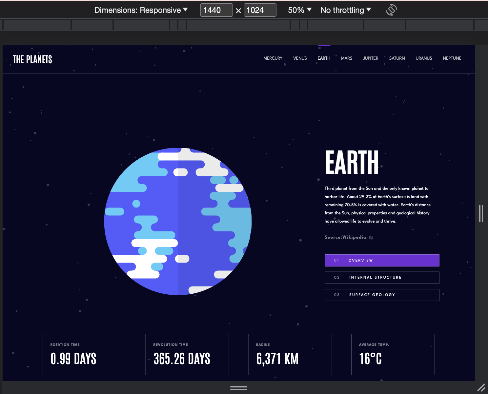
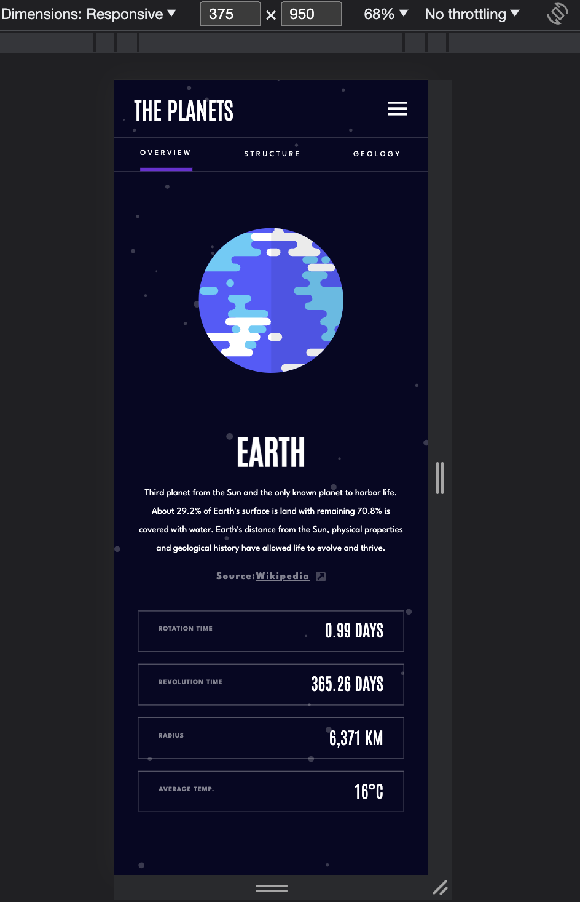

# Frontend Mentor - Planets fact site solution

This is a solution to the [Planets fact site challenge on Frontend Mentor](https://www.frontendmentor.io/challenges/planets-fact-site-gazqN8w_f). Frontend Mentor challenges help you improve your coding skills by building realistic projects.

## Table of contents

- [Overview](#overview)
  - [The challenge](#the-challenge)
  - [Screenshot](#screenshot)
  - [Links](#links)
- [My process](#my-process)
  - [Built with](#built-with)
  - [What I learned](#what-i-learned)
- [Author](#author)

## Overview

This project represents a web application which allow users to explore the planets inside the solar system. The web application is developed for desktop, tablet and mobile screen sizes.

### The challenge

Users should be able to:

- View the optimal layout for the app depending on their device's screen size
- See hover states for all interactive elements on the page
- View each planet page and toggle between "Overview", "Internal Structure", and "Surface Geology"

### Screenshot

#### Desktop Version

#### Tablet Version

#### Mobile Version

### Links

- Solution URL: [Solution URL here](https://github.com/AlinaAlexandraVizireanu/planets-fact-site)
- Live Site URL: [Live site URL here](https://alinaalexandravizireanu.github.io/planets-fact-site/)

## My process

I started this project by checking the design on the Figma file, then I created the website's structure with HTML and then used CSS to implement the style. The logic part of the application was built with JavaScript where I made an HTTP request using AXIOS.

### Built with

- Semantic HTML5 markup
- CSS custom properties
- Flexbox
- CSS Grid
- JavaScript
- Axios

### What I learned

In the process of building this project, I've used mostly Flexbox for positioning which helped me to deepen my knowledge regarding positioning with Flexbox.
While I was implementing the logic part I also deepened my JavaScript skills and I also improved my skills working with Axios.

## Author

- Website - [Alina Alexandra Vizireanu](https://alinaalexandravizireanu.github.io/planets-fact-site/)
- Frontend Mentor - [@AlinaAlexandraVizireanu](https://www.frontendmentor.io/profile/AlinaAlexandraVizireanu)